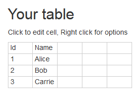

# Plain Text Table - User Manual

Interactively create and edit tables and export them to plain text.
The tool can be used [online](http://lorefnon.me/plain-text-table).

## Edit the table

Edit the grid and fill it with the the data you want to represent as text.

With the context menu in each cell, the text alignment (vertical and horizontal) can be set.
Those properties are reflected in the output.

## Type option

With the type menu you can influence the type of table you want to obtain.

__Grid__ (default):

    ┌────┬────────┐
    │ Id │ Name   │
    ├────┼────────┤
    │ 1  │ Alice  │
    ├────┼────────┤
    │ 2  │ Bob    │
    ├────┼────────┤
    │ 3  │ Carrie │
    └────┴────────┘

__Header (first line)__:

    ┌────┬────────┐
    │ Id │ Name   │
    ├────┼────────┤
    │ 1  │ Alice  │
    │ 2  │ Bob    │
    │ 3  │ Carrie │
    └────┴────────┘

__Columns only__:

    ┌────┬────────┐
    │ 1  │ Alice  │
    │ 2  │ Bob    │
    │ 3  │ Carrie │
    └────┴────────┘

### Style option

With the style menu you can influence the style of the borders of your output table.

__Single border__ (default):

    ┌────┬────────┐
    │ Id │ Name   │
    ├────┼────────┤
    │ 1  │ Alice  │
    ├────┼────────┤
    │ 2  │ Bob    │
    ├────┼────────┤
    │ 3  │ Carrie │
    └────┴────────┘

__Double border__:

    ╔════╦════════╗
    ║ Id ║ Name   ║
    ╠════╬════════╣
    ║ 1  ║ Alice  ║
    ╠════╬════════╣
    ║ 2  ║ Bob    ║
    ╠════╬════════╣
    ║ 3  ║ Carrie ║
    ╚════╩════════╝

__ASCII characters__:

    +----+--------+
    | Id | Name   |
    +----+--------+
    | 1  | Alice  |
    +----+--------+
    | 2  | Bob    |
    +----+--------+
    | 3  | Carrie |
    +----+--------+

## Cell padding

There is a checkbox to configure if additional spaces should be added to ensure a cell padding of one space in each cell.

__Checked__ (default):

    ┌────┬────────┐
    │ Id │ Name   │
    ├────┼────────┤
    │ 1  │ Alice  │
    │ 2  │ Bob    │
    │ 3  │ Carrie │
    └────┴────────┘

__Not checked__ (default):

    ┌──┬──────┐
    │Id│Name  │
    ├──┼──────┤
    │1 │Alice │
    ├──┼──────┤
    │2 │Bob   │
    ├──┼──────┤
    │3 │Carrie│
    └──┴──────┘

## Output

The output is displayed right below the table.